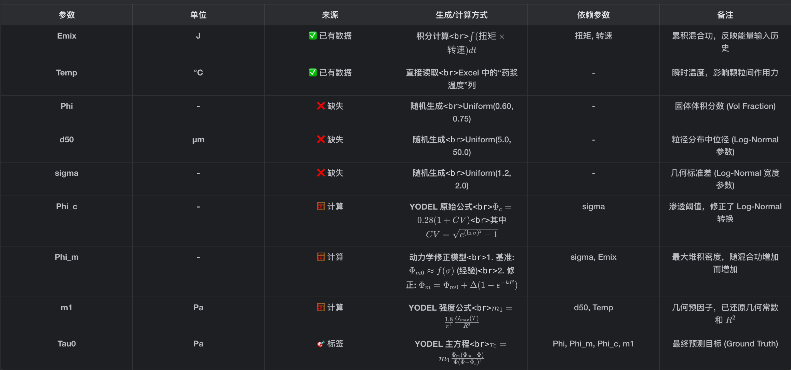
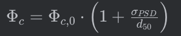
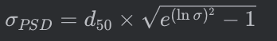
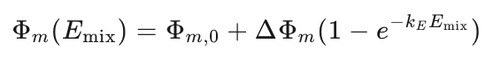
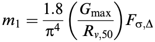

# **广义颗粒网络模型（Wildemuth-Williams 变体）**

核心思想是：**屈服应力源于颗粒在接近最大堆积时的网络强度，其发散形式与粘度类似**。

机理：


**参数说明**：

- **τ_y**：屈服应力（Pa）、
- **τ_0**：液体基质的特征应力尺度（Pa），与HTPB的弹性/粘性相关，需通过少量实验标定
- **Φ, Φ_m, [η]**：与KD模型中的定义**完全一致**，无需修改


基于目前动态/静态因素，**最合理的屈服预测机理**是：

**工程变体KD模型 + 动态参数驱动的有效结构参数修正**


**公式参数：**

| 参数        | 静态贡献               | 动态贡献                 | 工程经验公式                                                 |
| :---------- | :--------------------- | :----------------------- | :----------------------------------------------------------- |
| **Φ_eff**   | PSD + 分散剂 → 理论Φ_m | E_mix → 分散度提升       | E_mix越大，Φ_eff越接近理想值) |
| **[η]_eff** | 颗粒形貌（长径比）     | 分散剂 → 网络效率降低    | （AR为长径比，C_disp为分散剂浓度) |
| **τ_0**     | η_liquid（基质粘度）   | E_mix, T_hist → 网络强度 | （混合功指数强化网络) |

**一、直接测量参数（实验获取）**

| 参数                         | 物理含义                           | 获取方法                                                     | 典型值（推进剂体系）                     |
| :--------------------------- | :--------------------------------- | :----------------------------------------------------------- | :--------------------------------------- |
| **Φ（固体体积分数）**        | 药浆中AP、Al等固体总体积占比       |                                                              | 0.65-0.78（高固含量）                    |
| **η_liquid（液体基质粘度）** | 纯HTPB粘合剂在混合结束温度下的粘度 | 旋转流变仪（平板或同轴圆筒） 测试温度 = T_end                | 2-10 Pa·s（50-70°C）                     |
| **PSD（颗粒大小分布）**      | AP/Al的粒径分布特征                |                                                              | 粗AP: 200-400μm 细AP: 20-50μm Al: 5-30μm |
| **T_hist（温度历史）**       | 混合全过程温度曲线T(t)             | 插入式热电偶记录 提取T_max, T_end, 升温速率                  | 混合终点50-70°C 峰值可能达80-90°C        |
| **E_mix（总混合功）**        | 混合过程输入的总机械能             |  | 50-300 kJ/kg                             |

------

**二、理论计算参数（文献+经验）**

| 参数                          | 物理含义                   | 典型值    | 关键影响因素            |
| :---------------------------- | :------------------------- | :-------- | :---------------------- |
| **[η]_eff（有效特征粘度）**   | 颗粒网络形成效率因子       | 2.5-4.5   | 颗粒长径比AR 分散剂浓度 |
| **Φ_m,ideal（理论最大堆积）** | 理想状态下颗粒最大堆积分数 | 0.68-0.78 | PSD跨度 颗粒形貌        |


# **YODEL基础模型（直接预测屈服值）**

机理：


**参数体系**：

- **τ_0**：待预测的屈服值（Pa）
- **Φ**：已有的固体体积分数
- **Φ_m**：最大堆积体积分数（需通过混合终点实验测定，并通过混合功修正）
- **Φ_c**：渗透阈值（由PSD计算，非拟合参数）
- **m₁**：颗粒间作用力参数（可关联分散剂和混合能量）

详情见文献

Yodel: A Yield Stress Model for Suspensions-公式42：

------

### **动态混合参数修正**

#### **2.1 混合功 E_mix 对 Φ_max 的修正**

原文第1252页通过滤压实验证明Φ_max可独立测定，且与颗粒重排程度相关。混合功通过改善堆积效率提升有效Φ__max：


- **Φ_max,0**：初始松散堆积分数（约0.55）
- **ΔΦ_max**：可提升幅度（约0.05-0.08，需标定）
- **k_E**：混合效率系数（与混合器几何相关）

**对m₁的间接影响**：由于m₁ ∝ 1/Φ_max（公式41），混合功通过Φ_max影响m₁。

#### **2.2 扭矩/转速 → 剪切脱附修正 G_max**

高剪切导致分散剂部分脱附，**减小吸附层厚度 L_S**，从而**增大 G_max**（因G_max ∝ 1/H²）。

**脱附修正模型**（基于第1245页公式3）：

- **γ˙^mix** ：由扭矩和转速换算的混合剪切速率
- **γ˙^crit** ：分散剂稳定吸附临界剪切速率（需标定）
- **β**：脱附敏感系数（实验测定）


# 数据生成

| 参数      | 来源             | 生成方式                 | 依赖                  |
| --------- | ---------------- | ------------------------ | --------------------- |
| **Emix**  | 已有数据         | 从 Excel 积分计算        | 扭矩、转速            |
| **Temp**  | 已有数据         | 从 Excel 直接读取        | 药浆温度列            |
| **Phi**   | 缺失             | 随机生成 [0.60, 0.75]    | -                     |
| **d50**   | 缺失             | 随机生成 [5, 50] μm      | -                     |
| **sigma** | 缺失             | 随机生成 [1.2, 2.0]      | -                     |
| **Phi_c** | 计算             | 对基础渗透阈值的经验修正 | d50,sigma             |
| **Phi_m** | 计算             | YODEL + 动力学修正       | sigma, Emix           |
| **m1**    | 计算             | YODEL 强度公式           | d50, Temp             |
| **Tau0**  | 标签（预测结果） | YODEL 主方程             | Phi, Phi_m, Phi_c, m1 |



#### 1. **`Emix(混合功_J)`** - 混合能量

**来源**: **直接引用Excel 数据**

- **提取逻辑** (`src/data/loader.py` ):

  ```python
  power = df['扭矩'] * df['转速']
  emix = np.sum(power) * dt  # dt=60秒
  ```

- **物理意义**: 整锅混合过程中，搅拌器对浆料做的总功（单位：焦耳 J）。

- **计算方式**:

  - 从Excel 文件中逐行读取 `扭矩` 和 `转速`。
  - 计算瞬时功率 = 扭矩 × 转速。
  - 对整个混合过程积分（求和 × 时间间隔）得到总功。

- **示例**: 如果一锅料混合了 200 分钟=200*60秒，平均功率 30,000，则 *Emix*≈30000×200×60=3.6×10^8 J。

#### 2. **`Temp(温度_C)`** - 药浆温度

**来源**: **直接引用Excel 数据**

- **提取逻辑** (`src/data/loader.py` ):

  ```python
  temp_end = df['药浆温度'].iloc[-1]
  ```

- **物理意义**: 混合结束时的药浆温度（单位：摄氏度 °C）。

- **计算方式**: 直接读取 Excel 文件中 `药浆温度` 列的**最后一个值，逻辑错误，拆分数据后替换为混合结束瞬间**。

- **示例**: 如果某锅料出料时温度为 51.72°C，则 `Temp = 51.72`。

------

#### 3. **`Phi(固含量)`** - 固体体积分数

**来源**: **随机生成（数据中没有）**

- **生成逻辑** (`src/data/generator.py` ):

  ```python
  phi = np.random.uniform(0.60, 0.75, n_total)
  ```

- **物理意义**: 浆料中固体颗粒占总体积的比例（无量纲，范围 0-1）。

- **生成范围**: 0.60 - 0.75（这是火箭燃料推进剂的典型高固含范围），n_total是生成的数据行数。

-  Excel 数据中没有记录配方信息（固含量），假设在合理范围内随机采样，模拟不同配方。

#### 4. **`d50(中位径_um)`** - 粒径分布中位径

**来源**: **随机生成（数据中没有）-------实际有颗粒大小分布PSD后可以直接计算**

- **生成逻辑** (`src/data/generator.py` ):

  ```python
  d50 = np.random.uniform(5.0, 50.0, n_total)
  ```

- **物理意义**: 颗粒粒径分布的中位数（单位：微米 μm）。50% 的颗粒直径小于此值。

- **生成范围**: 5 - 50 μm（典型的固体推进剂颗粒尺寸）。

- 数据中没有 PSD（粒径分布）信息，所以假设服从 Log-Normal 分布（粒径分布在**对数空间**上更接近正态分布）并随机采样。

#### 5. **`sigma(几何标准差)`** - 粒径分布宽度

**来源**: **随机生成（数据中没有）-------实际有颗粒大小分布PSD后可以直接计算**

- **生成逻辑** (src/data/generator.py):

  ```python
  sigma = np.random.uniform(1.2, 2.0, n_total)
  ```

- **物理意义**: 描述粒径分布的宽度（无量纲）。σ*=1 表示单分散（所有颗粒一样大），*σ>1 表示多分散。

- **生成范围**: 1.2 - 2.0（典型的工业粉体分布宽度）。

- **为什么随机生成**: 同样因为缺少 PSD 数据。

------

#### 6. **`Phi_c_true(渗透阈值)`** - 颗粒网络形成的临界固含量

**来源**: **机理公式计算**

- **计算公式** (`src/physics/yodel.py` ):

  

  - Φ*c*,0：**基础渗透阈值** ≈ 0.28（对于球形颗粒的随机堆积）
  - *σPSD*：粒径分布的**标准差**（线性空间）依赖于刚刚生成的几何标准差与中位径
  - *d*50：**中位径**
  - σPSD/d50：**变异系数** (Coefficient of Variation, CV)

  ```python
  ln_sigma = torch.log(sigma)
  cv = torch.sqrt(torch.exp(ln_sigma**2) - 1)
  
  # 代入 YODEL 原始公式
  phi_c = 0.28 * (1 + cv)
  ```

- **物理意义**: 当固含量 Φ<Φ*c* 时，颗粒之间没有形成连续网络，浆料表现为牛顿流体（无屈服应力）。当Φ>Φ*c* 时，颗粒网络形成，开始出现屈服应力。

- **依赖参数**: `sigma`（粒径分布越宽，越容易形成网络，Φ*c* 越高）。

- **文献依据**: YODEL 模型（Flatt & Bowen, 2006）中的渗透理论。

#### 7. **`Phi_m_true(最大堆积)`** - 理论最大堆积密度

**来源**: **机理公式计算（含动力学修正）**

- **计算公式** (`src/data/generator.py` ):

- ### 下方是一个经验公式！！！！

  

  ```python
  phi_m0 = 0.65 + 0.1 * (t_sigma - 1.2)  # 基础堆积 --- 用于在没有PSD数据的时候模拟物理趋势
  phi_m = calc_phi_m_dynamic(phi_m0, t_emix)  # 混合功修正
  ```

- calc_phi_m_dynamic**动力学修正** (src/physics/yodel.py):

  ```python
  delta = phi_m_ultimate - phi_m0
  # 确保 delta 非负
  delta = torch.clamp(delta, min=0.0)
  return phi_m0 + delta * (1 - torch.exp(-k_E * Emix))
  ```

- **物理意义**:

  - **基础 Φm,0**: 由粒径分布决定（宽分布堆积更密）。
  - **动力学增强**: 混合功 Emix 越大，团聚体被打散越充分，实际可达到的最大堆积密度越高。

- **依赖参数**: `sigma`, `Emix`。

- **文献依据**: 您的技术路线文档（`docs/会话记忆.md`）中提出的混合能改善堆积密度的假设。

#### 8. **`m1_true(强度因子_Pa)`** - 几何预因子

**来源**: **机理公式计算**

- **计算公式** (`src/physics/yodel.py` ):YODEL 模型公式 (41)

  

  **Rv,50：**体积中位半径->*d*50 是直径，d50/2 就是半径，虽然原文 Eq. 41 写的是 *R*，但为了满足应力量纲 (N*/*m2)，这里修正为 R^2。

  **Fσ,Λ：**粒径分布函数，对应文献公式35，计算 Fσ,Λ 需要完整的 PSD 数据进行O*(*N^2) 的求和运算。在当前阶段（数据生成），我们没有真实 PSD,于是假设假设 PSD 形状的影响主要体现在 Φ*m* 和 Φ*c* 上，而忽略了它对m1 的二阶修正，此处**取1**。

  

  ```python
  m1 = G_max / ((d50 / 2.0) ** 2 + 1e-8)   
  ```

- **其中 Gmax（**颗粒间的最大作用力 (Maximum Interparticle Force)**，单位是纳顿 (nN)） 的计算** (`src/data/generator.py` 第 63-64 行):

  ```python
  # 由于 calc_m1 引入了 1.8/pi^4 (~0.0185) 的常数，且 R 使用微米单位
  # g_max_base = 80000.0 对应真实物理力约 80 nN (纳牛)，符合范德华力/液桥力范围
  g_max_base = 80000.0
  g_max = g_max_base * (1 + 0.05 * (t_temp - 25.0)) # 简单线性假设用于生成数据
  ```

- **物理意义**:

  - m1 是 YODEL 方程中的强度系数，与颗粒间最大作用力 Gmax 和颗粒半径 R 有关。
  - *Gmax* 随温度升高而增大（假设固化主导）。
  - 公式：m1∝Gmax/R^2

- **依赖参数**: `d50`, `Temp`。

- **文献依据**: YODEL 模型公式 (41)。

------

### **输出标签（最终预测目标）**

#### 9. **`Tau0(屈服应力_Pa)`** - 浆料屈服应力

**来源**: **YODEL 主方程计算（Ground Truth）**

- **计算公式** (src/physics/yodel.py):

  ```python
  tau0 = m1 * (phi_m * (phi_m - phi)) / (phi * (phi - phi_c)^2)
  ```

- **物理意义**: 浆料开始流动所需的最小剪切应力（单位：帕斯卡 Pa）。这是最终要预测的目标变量。

- **依赖参数**: `Phi`, `Phi_m`, `Phi_c`, `m1`（即依赖所有上述参数）。

- **文献依据**: YODEL 模型核心公式 (42)。


# 需要解决的问题：

fhi = 0.5-0.75 文献引用，

影响因子，直接算

特征粘度：2.48

基质：2000吧         

数据的特征分析图

| 屈服值 | 21.6 |
| ------ | ---- |
|        |      |